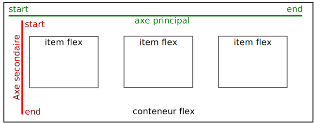

:tocdepth: 3

=====
 CSS
=====

.. include:: commondefs.rst.inc
.. ifslides::

   .. include:: credits.rst.inc


.. index:: feuille de style, stylesheet

Feuille de style
================

Rappels
+++++++

* CSS signifie `Cascading StyleSheet`:eng:\.

* HTML ne décrit que la structure logique (le fond) des documents,

  - la structure physique (la forme) est spécifiée par une feuille de style
    en CSS.


Avantages
---------

* cohérence au sein du document
* cohérence au sein d'un ensemble de documents (charte graphique)

  - mutualisation de la feuille de style

* séparation des tâches (développeur web / graphiste)


.. index:: link; rel=stylesheet

Déclarer une feuille de style
+++++++++++++++++++++++++++++

Pour attacher une feuille de style à un document HTML,
on ajoute dans l'élément `<head>`:html: une balise `<link>`:html:

.. code-block:: html

  <head>
    <link rel="stylesheet" type="text/css"
          href="mystyle.css" />
  </head>

* Les valeurs des attributs `rel`:html: et `type`:html: sont fixées.
* L'attribut `href`:html: contient l'URL de la feuille de style.
* On peut avoir *plusieurs* feuilles de style (leurs effets se cumulent).

Déclarer une feuille de style (2)
---------------------------------

* On peut également spécifier la feuille de style
  directement dans le document HTML, à l'aide de la balise `<style>`:html: ;

  - mais on perd le bénéfice de la mutualisation.

.. code-block:: html

  <head>
    <style type="text/css">
      /* your CSS here */
    </style>
  </head>

.. note::

   Cela peut malgré tout être utile en phase de test,
   ou si on souhaite minimiser le nombre de requêtes HTTP.

Outils
++++++

.. contents::
   :local:
   :depth: 0
   :backlinks: none


Valideur
--------

Comme pour le HTML, le W3C fournit un service en ligne de validation de CSS :

http://jigsaw.w3.org/css-validator/

Son utilisation vous est *vivement* recommandée.


Inspecteur
----------

Certains navigateurs (notamment Firefox et Chrome) offrent
des outils puissants pour les développeurs web.

Dans le menu contextuel (clic droit) sur n'importe quel élément,
*Inspect Element* ouvre une interface d'inspection qui permet :

* de naviguer dans l'arbre HTML,
* de voir les règles qui s'appliquent à chaque élément,
* de modifier dynamiquement le code HTML et la feuille de style.


Liens utiles
------------

Référence et apprentissage :

* http://www.w3.org/Style/CSS/
* http://www.w3schools.com/css/
* http://caniuse.com/

Démonstrations :

* http://www.csszengarden.com/

.. note::

   Le site de démonstration ci-dessus
   est construit sur le principe suivant :
   la page HTML est toujours la même, seule la feuille de style change.


Règle
=====

.. index:: règle, sélecteur, propriété

Principe
++++++++

* En CSS, la mise en forme est spécifiée par un ensemble de **règles**.

* Une règle typique est composée de trois parties :

  - un **sélecteur**,
  - une **propriété**,
  - une **valeur**

Exemple :

.. code-block:: css

   em { font-style: italic }
   /* le contenu des balises <em> devrait être en italique */


Combinaison de règles
+++++++++++++++++++++

Plusieurs règles similaires peuvent coexister :

.. code-block:: css

    em   { font-style: italic }
    em   { color: blue }
    cite { font-style: italic }
    cite { color: blue }


Regroupement par sélecteur
--------------------------

On peut regrouper les règles ayant le même sélecteur,
en séparant les couples propriété-valeur par un point-virgule (« ; »).

.. code-block:: css

    em   { font-style: italic ; color: blue }
    cite { font-style: italic ; color: blue }

Regroupement par contenu
------------------------

On peut regrouper des règles ayant le même contenu,
en séparant les sélecteurs par une virgule (« , »).

.. code-block:: css

    em, cite { font-style: italic ; color: blue }

Sensibilité aux espaces
-----------------------

CSS est insensible aux espaces et aux sauts de ligne.
On peut donc en ajouter autant que nécessaire pour faciliter la mise en page.

.. code-block:: css

    em,
    cite
    {
        font-style : italic ;
        color      : blue   ;
    }

NB : on peut également rajouter un point-virgule
après le dernier couple propriété-valeur,
ce qui favorise l'évolutivité de la feuille de style.


Propriétés du texte
===================


.. index:: .font-style, .font-weith, .font-variant, .font-family, .font-size

Propriétés sur la police
++++++++++++++++++++++++

.. raw:: html

  <ul>
   <li><tt class="literal code css">font-style</tt> :
       <ul class="css-values">
       <li style="font-style: normal">normal</li>
       <li style="font-style: italic">italic</li>
       <li style="font-style: oblique">oblique</li>
       </ul></li>
   <li><tt class="literal code css">font-weight</tt> :
       <ul class="css-values">
       <li style="font-weight: normal">normal</li>
       <li style="font-weight: bold">bold</li>
       <li style="font-weight: bolder">bolder</li>
       <li style="font-weight: lighter">lighter</li>
       </ul>
       <ul>
         <li> ou une valeur entre 100 et 900 (400 = normal)</li>
         <li> NB: beaucoup de polices ne supportent que normal et bold</li>
       </ul></li>
   <li><tt class="literal code css">font-variant</tt> :
       <ul class="css-values">
       <li style="font-variant: normal">normal</li>
       <li style="font-variant: small-caps">small-caps</li>
       </ul>
       <ul>
         <li> NB: les small-caps sont plus petite que les majuscules :
           <span style="font-variant: small-caps"
           >Pierre-Antoine Champin</span></li>
       </ul></li>
   <li><tt class="literal code css">font-family</tt> :
       <ul class="css-values"><li>(voir ci-après)</ul></li>
   <li><tt class="literal code css">font-size</tt> :
       <ul class="css-values"><li>(voir ci-après)</ul></li>
  </ul>


Police avec ``font-family``
+++++++++++++++++++++++++++

Lorsqu'on publie sur le Web,
on ne peut pas faire l'hypothèse que
tous les clients auront les mêmes polices installées sur leur système.

Si on veut utiliser une police spécifique,
il faut donc indiquer au navigateur comment la charger :

.. code-block:: css

  @font-face
  {
    font-family: MyNiftyFont;
    src: url('http://example.org/nifty-font.ttf'),
         url('http://example.org/nifty-font.eot');
  }

.. note::

   Comme le montre l'exemple,
   il peut être nécessaire de fournir la police dans plusieurs formats,
   afin de maximiser les chances de compatibilité avec différents navigateurs.


Polices génériques
------------------

CSS définit des polices génériques :

.. raw:: html

  <ul class="css-values small">
  <li style="font-family: serif ! important">serif</li>
  <li style="font-family: sans-serif ! important">sans-serif</li>
  <li style="font-family: cursive ! important">cursive</li>
  <li style="font-family: fantasy ! important">fantasy</li>
  <li style="font-family: monospace ! important">monospace</li>
  </ul>

Inconvénient : leur apparence varie d'un système à l'autre
(et d'un navigateur à l'autre).

Avantage : elles garantissent un affichage
pas *trop différent* des intentions de l'auteur.


Bonne pratique
--------------

* Spécifier une *liste* de polices,

* par ordre croissant de probabilité qu'elle soit disponible,

* et en terminant toujours pas une police générique.

.. code-block:: css

   font-family: MyNiftyFont, Times New Roman, serif


Taille du texte avec ``font-size``
++++++++++++++++++++++++++++++++++

La taille de police est généralement exprimée en points pica :

.. code-block:: css

  body {  font-size: 12pt ; }

ou relativement à la taille de la police dans l'élément englobant.

.. code-block:: css

  h1 {  font-size: 150% ; }

Mais toutes les `unités de mesures <longueur>`:ref: reconnues par CSS
sont en théorie utilisables.


.. index:: .test-decoration, .text-transform, .text-align, .color,
           .background-color

Autres propriétés
+++++++++++++++++

.. raw:: html

  <ul>
   <li><tt class="literal code css">text-decoration</tt> :
       <ul class="css-values" style="display: block">
       <li><span style="text-decoration: none">none</span></li>
       <li><span style="text-decoration: underline">underline</span></li>
       <li><span style="text-decoration: overline">overline</span></li>
       <li><span style="text-decoration: line-through">line-through</span></li>
       <li><span style="text-decoration: blink">blink</span></li>
       </ul></li>
   <li><tt class="literal code css">text-transform</tt> :
       <ul class="css-values" style="display: inline-block">
       <li style="text-transform: none">none</li>
       <li style="text-transform: capitalize">capitalize</li>
       <li style="text-transform: uppercase">uppercase</li>
       <li style="text-transform: lowercase">lowercase</li>
       </ul>
       <ul><li>NB: <span style="text-transform: uppercase">uppercase</span> est
       différent de <span style="font-variant:
       small-caps">small-caps</span></ul></li>
   <li><tt class="literal code css">text-align</tt> : <ul class="css-values">
       <li>left</li>
       <li>center</li>
       <li>right</li>
       <li>justify</li>
       </ul>
   <li><tt class="literal code css">color</tt> :
       (<span style="color: red">voir</span>
        <span style="color: green">ci-</span
        ><span style="color: blue">après</span>)</li>
   <li><tt class="literal code css">background-color</tt> :
       (<span style="background-color: #8FF">voir</span>
        <span style="background-color: #F8F">ci-</span
        ><span style="background-color: #FF8">après</span>)</li>
  </ul>


.. index:: couleur, rgb

Couleurs en CSS : RGB
+++++++++++++++++++++

.. figure:: _static/RGB_illumination.*
   :width: 40%

   Source image `Wiki commons`__

   __ <http://commons.wikimedia.org/wiki/File:RGB_illumination.jpg>`

.. code-block:: css

  em { color: #f00 }                 /* #rgb */
  em { color: #ff0000 }           /* #rrggbb */
  em { color: rgb(255,0,0) }
  em { color: rgb(100%, 0%, 0%) }


Couleurs en CSS : autres moyens
-------------------------------

* couleurs prédéfinies:
  `black`:css:, `white`:css:, `red`:css:, `green`:css:, `blue`:css:,
  `yellow`:css:...

  * mais aussi `transparent`:css:
  * la liste est *très* longue

* transparence (alpha): ``rgba(r,g,b,a)``
  où *a* varie entre 0.0 (invisible) and 1.0 (opaque)

* pour en savoir plus : http://www.w3.org/TR/css3-color/


Sélecteurs complexes
====================

Principe
++++++++

On a souvent besoin d'appliquer des règles de présentations différentes
à la même balise en fonction de son *contexte*.

Ceci peut s'exprimer en combinant plusieurs sélecteurs :

.. code-block:: css

   X Y { /* s'applique à tout élément Y situé
            à l'intérieur d'un X — même indirectement */ }

   X > Y { /* s'applique à tout élément Y situé
              directement à l'intérieur d'un X */ }

   X + Y { /* s'applique à tout élément Y situé
              immédiatement après un X */ }

.. TODO illustrer sur un arbre graphviz?
.. note::

   En considérant la `structure_en_arbre`:ref: vue dans la section sur HTML,
   on peut reformuler les connecteurs ainsi :

   - X Y : déplacement quelconque vers le bas
   - X > Y : déplacement d'un cran vers le bas
   - X + Y : déplacement d'un cran vers la droite (sous le même parent)

   Notons qu'il existe un quatrième connecteur :

   - X ~ Y : déplacement vers la droite (sous le même parent)


Principe (suite)
----------------

* Les sélecteurs complexes peuvent bien sûr être combinés à leur tour.

* On peut également utiliser dans les combinaisons le sélecteur ``*``,
  qui est satisfait par *n'importe quelle* balise.

Exemples
--------

.. code-block:: css

   q        { font-style: italic; }
   q em     { font-weight: bold; }
   q strong { text-decoration: underline; }

   body>h1  { text-align: center; }

   h1+* { font-variant: small-caps; }

   ul ul li { font-size: 80%; }


Exercice
--------

Reprenez le code HTML que vous avez écrit pour
`cet exercice <exo_catane3>`:ref:,
et attachez le à une nouvelle feuille de style.

*Sans toucher au code HTML*,
ajoutez à votre feuille de style les règles qui permettront d'obtenir
le résultat disponible ici__\.

__ _static/exo_css_text/sujet.png


.. index:: @class, @id

.. _class:

Classes et identifiant
++++++++++++++++++++++

HTML autorise les attributs suivant dans n'importe quelle balise :

* `id`:html: accepte comme valeur un nom *unique*
  (il est interdit d'utiliser le même `id`:html:
  à deux endroits du même document) ;
* `class`:html: accepte comme valeur une liste de noms séparés par des espaces
  (le même nom de classe peut être présent dans plusieurs balises).

.. code-block:: html

   <ol id="contents">...</ol>

   <article class="post funny">...</article>


Sélecteurs associés
-------------------

CSS permet de sélectionner un élément par son identifiant ou sa classe,
en spécifiant ou non le type de la balise.

.. code-block:: css

  article.post { /* tout <article> de la classe 'post' */ }

  .funny       { /* tout élément de la classe 'funny' */ }

  ol#contents  { /* toute <ol> avec l'id 'contents' */ }

  #contents    { /* tout élément avec l'id 'contents' */ }

On peut bien sûr utiliser ces sélecteurs dans des sélecteurs complexes.


Bonne utilisation des identifiants
----------------------------------

* Un identifiant est unique au sein d'un document,

  - mais il peut se répéter d'un document à l'autre ;

  - par exemple, l'identifiant ``contents`` est peut-être utilisé
    pour identifier la table des matière sur toutes les pages d'un site.

* Il y a donc un intérêt à mutualiser les règles de présentation
  pour un identifiant dans une feuille de style globale.


Bonne utilisation des classes
-----------------------------

* Les classes permettent de définir des catégories sémantiques plus précises
  que celles fournies par HTML ; soit

  - un cas particulier par rapport à une balise existante (*e.g.* ``post``),
  - une catégorie transverse (*e.g.* ``funny``).

* Le nom de la classe doit décrire ce que *signifie* la classe,
  et non la mise en forme qui lui sera appliquée :

  - éviter par exemple ``rouge-souligné`` ou ``centré-16pt``,
  - qui deviendront obsolètes dès que votre charte graphique changera.


Priorité
++++++++

Considérons :

.. code-block:: css

  em { font-style: italic }

  .summary em { font-style: normal;
                font-weight: bold }

Quelle serait la mise en forme du HTML suivant ?

.. code-block:: html

   <p class="summary">This summary
   is <em>short</em>.</p>

Réponse
-------

.. raw:: html

   <p class="summary rendered">This summary
   is <em style="font-style: normal; font-weight: bold">short</em>.</p>

Intuitivement, la règle *la plus spécifique* a toujours la priorité.

La manière dont CSS détermine la priorité (`cascading`:eng:) sont complexes,
mais elles satisfont la plupart du temps cette intuition.


Exercice
--------

.. TODO


.. slide:: Suite la `seance5`:ref:
   :level: 2
   :class: nav-seance

   * `Liens et images en HTML <liens>`:ref:


.. _position:

Position et espacement
======================


.. index:: marge

Marge
+++++

La **marge** d'un élément est
l'espace libre *minimum* qui doit être laissé autour de cet élément.

L'espace effectif entre deux éléments voisins est déterminé en prenant
la plus grande des deux marges.


.. index:: .margin, .margin-*

Propriétés ``margin``
---------------------

* `margin-top`:css:\ : (longueur)
* `margin-right`:css:\ : (longueur)
* `margin-bottom`:css:\ : (longueur)
* `margin-left`:css:\ : (longueur)

On peut aussi utiliser la version synthétique, qui accepte 1 à 4 valeurs :

* `margin`:css:\ : (top) (right) (bottom) (left)

  - si ``left`` est omis, il hérite de ``right``
  - si ``bottom`` est omis, il hérite de ``top``
  - si ``right`` est omis, il hérite de ``top``

.. note::

   * Lorsqu'une propriété CSS prend plusieurs valeurs,
     elles sont généralement séparées par des espaces.
   * Ce principe d'héritage est utilisé par d'autres propriétés
     (par exemple `padding`:css:).


.. _longueur:

Longueurs en CSS
----------------
CSS reconnaît les unités de longueur suivantes :

==== ==================================================
 cm   centimètre
 mm   millimètre
 in   pouce (`inch`:eng:)
 pt   point pica (1/72 in)
 em   taille de la police courante
 ex   hauteur du caractère *x* dans la police courante
 px   « pixel CSS » (varie avec le niveau de zoom)
 vw   1% de la largeur de la fenêtre
 vh   1% de la hauteur de la fenêtre
==== ==================================================

Pour en savoir plus, voir ici__.

__ http://www.w3.org/TR/css3-values/#lengths


.. index:: .width, .height, .min-width, .max-width, .min-height, .max-height

Taille
++++++

La taille d'un élément peut être fixée
grâce aux propriétés `width`:css: et `height`:css:.

Ces propriétés acceptent des longueurs

* absolues, ou
* en pourcentage (par rapport à l'élément englobant).

.. raw:: html

   <p style="width: 50%">Par exemple, ce paragraphe a la propriété
     <span class="literal code css">width: 50%</span>,
     il occupe donc la moitié de la largeur de la page.

.. note:: Certains éléments ignorent
   les propriétés `width`:css: et `height`:css:,
   typiquement ceux représentant
   un mot ou un groupe de mot à l'intérieur d'une phrase
   (par exemple `<em>`:html: ou `<a>`:html:).

   On peut cependant les forcer à en tenir compte,
   en fixant leur propriété `display`:css: à `inline-block`:css:.


Intervalles de taille
---------------------
On peut également contraindre un élément de manière plus souple
avec les propriétés
`min-width`:css:, `max-width`:css:, `min-height`:css: et `max-height`:css:.

C'est utile lorsqu'on ne connaît pas à l'avance
le contenu des éléments concernés :

* feuille de style mutualisée,
* contenu dynamique,
* `reponsive design`:eng:.

.. TODO ce serait bien d'avoir un voire plusieurs exemples ici


.. index:: .overflow

Débordement
-----------

Lorsqu'on contraint la taille d'un élément
(par exemple un paragraphe),
il est possible que cette taille ne suffise plus pour afficher le *contenu* de cet élément.

La propriété :css:`overflow` permet de paramétrer le comportement de l'élément dans cette circonstance.
Elle peut prendre les valeurs suivantes.

* `visible`:css: (valeur par défaut) : le contenu s'affichera entièrement,
  quitte à dépasser des limites de l'élément
  (et donc à empiéter éventuellement sur d'autres éléments).

* `hidden`:css: : le contenu ne s'affiche qu'à l'intérieur de l'élément,
  quitte à être tronqué.

* `scroll`:css: : le contenu ne s'affiche qu'à l'intérieur de l'élément,
  mais des ascenseurs sont affichés pour le faire défiler.

* `auto`:css: : le navigateur choisit la solution qui lui semble la plus appropriée.


Exemples d'utilisation de :css:`overflow`
`````````````````````````````````````````
.. raw:: html

 <table class="rendered" style="width: 100%">
   <tr>
     <td style="border: 1px solid black">
       <div style="height: 3em; overflow: visible">
         visible<br>visible<br>visible<br>visible
       </div>
     </td>
     <td style="border: 1px solid black">
       <div style="height: 3em; overflow: hidden">
         hidden<br>hidden<br>hidden<br>hidden
       </div>
     </td>
     <td style="border: 1px solid black">
       <div style="height: 3em; overflow: scroll">
         scroll<br>scroll<br>scroll<br>scroll
       </div>
     </td>
     <td style="border: 1px solid black">
       <div style="height: 3em; overflow: auto">
         auto<br>auto<br>auto<br>auto
       </div>
     </td>
   </tr>
 </table>

.. index::
   double: affichage; inline
   double: affichage; block

.. _block:
.. _inline:

Mode d'affichage
++++++++++++++++

Il existe deux grands types d'éléments :

* Les éléments de type `inline`:css:,
* Les éléments de type `block`:css:.


Les éléments `inline`:css:
--------------------------

* Ils s'inscrivent dans le flux du texte.

* Leur taille est déterminée par leur contenu.

  + Les propriétés `width`:css: et `height`:css: sont sans effet sur eux.

* Exemples : `<a>`:html:, `<em>`:html:...


Les éléments `block`:css:
-------------------------

* Ils sont précédés et suivis d'un retour à la ligne.

* Ils prennent toute la largeur disponible,
  et uniquement la hauteur nécessaire.

  + Mais on peut changer leur taille
    avec les propriétés `width`:css: et `height`:css:.

* Exemples :  `<p>`:html:, `<section>`:html:, `<h1>`:html:, ...


.. index:: .display, .vertical-align

Changer le mode d'affichage
---------------------------

* `display`:css:\ : inline, block, inline-block, none

  + Un élément avec `display:inline-block`:css: se comporte
    comme un élément `inline` avec ses voisins (pas de retour à la ligne),
    mais comme un élément `block` pour son contenu (taille ajustable).

  + Un élément avec `display:none`:css: ne sera pas affiché.
    Ce mode est utile en conjonction avec la directive `@media <media>`:ref:.

* `vertical-align`:css:\ :

  + Cette propriété permet de spécifier
    comment des éléments inline ou inline-block s'alignent verticalement
    par rapport au flux du texte.

  + Pour plus de détails, voir
    http://www.w3.org/wiki/CSS/Properties/vertical-align .


.. index:: .float

Positionnement flottant
+++++++++++++++++++++++

Par défaut, les images appartiennent au flux de texte. Ainsi ::

  La Joconde 
  est probablement le tableau le plus connu au monde.

sera affiché comme suit :

.. raw:: html

 <p class="rendered" style="font-size: 100% ! important">
  La Joconde 
  est probablement le tableau le plus connu au monde.
 </p>

.. nextslide::
   :increment:

La propriété :css:`float`,
qui peut prendre comme valeur `left`:css: ou `right`:css:,
fait « flotter » un élément au bord de la page.

Ainsi, avec le CSS suivant :

.. code-block:: css

   img { float: right; }

le HTML précédent s'affichera ainsi :

.. raw:: html

 <p class="rendered floatingimg" style="font-size: 100% ! important">
  La Joconde  est
  probablement le tableau le plus connu au monde.
 </p>

.. note::

   Surtout utilisée pour les images,
   cette propriété peut également être utilisée pour tout type de figure
   (tableaux, notamment)
   ou certains contenus textuels (`<aside>`:html:).


.. _position2:

Positionnement avancé
=====================

Motivation
++++++++++

Les techniques de positionnement vues jusqu'ici (marges, flottants)
sont bien adapté à du texte simple,
mais limitées pour

  * des mises en pages plus complexes,

  * des interfaces plus interactives,

  * le *responsive design*.


Positionnement Flexbox
++++++++++++++++++++++

Ce modèle de boîtes `flexibles` se compose :

* d'un conteneur dont la propriété `display`:css: sera :

  - `flex`:css: pour qu'il se comporte comme un élément de type `block`
  
  - `inline-flex`:css: pour qu'il se comporte comme un élément de type `inline-block`
  
* d'items flex qui sont les enfants directs du conteneur

.. nextslide::



.. note:: Flexbox est plutôt bien reconnu par les différents navigateurs mais l'utilisation d'Autoprefixer (https://autoprefixer.github.io) peut s'avérer utile pour ajouter d'éventuels préfixes propriétaires.

.. index:: .flex-direction

`flex-direction`:css:\  : propriété du conteneur (1)
----------------------------------------------------

Elle donne la direction et le sens de l'axe principal

* `row`:css: horizontal orienté de droite à gauche (valeur par défaut)
  
* `row-reverse`:css: horizontal orienté de gauche à droite
  
* `column`:css: vertical orienté de haut en bas
  
* `column-reverse`:css: vertical orienté de bas en haut

Exemples d'utilisation de `flex-direction`:css:
```````````````````````````````````````````````

.. raw:: html

 <section class="flexboxes">
   <section>
     <h6>
       row
     </h6>
       <div style="display: flex; flex-direction: row">
         <div class="item1">item1</div>
         <div class="item2">item2</div>
         <div class="item3">item3</div>
       </div>
     </section>
     <section>
     <h6>
       row-reverse
     </h6>
       <div style="display: flex; flex-direction: row-reverse">
         <div class="item1">item1</div>
         <div class="item2">item2</div>
         <div class="item3">item3</div>
       </div>
     </section>
     <section>
     <h6>
       column
     </h6>
       <div style="display: flex; flex-direction: column">
         <div class="item1">item1</div>
         <div class="item2">item2</div>
         <div class="item3">item3</div>
       </div>
     </section>
     <section>
     <h6>
       column-reverse
     </h6>
       <div style="display: flex; flex-direction: column-reverse">
         <div class="item1">item1</div>
         <div class="item2">item2</div>
         <div class="item3">item3</div>
       </div>
   </section>
 </section>
 
.. index:: .justify-content
 
`justify-content`:css: : propriété du conteneur (2)
---------------------------------------------------
  
Elle gère l'alignement des items sur l'axe principal

* `flex-start`:css: (valeur par défaut)
  
* `flex-end`:css: 
  
* `center`:css: 
  
* `space-between`:css: 
  
* `space-around`:css:

Exemples d'utilisation de `justify-content`:css:
````````````````````````````````````````````````

.. raw:: html

 <section class="flexboxes">
   <section>
     <h6>
       flex-start
     </h6>
       <div style="display: flex; justify-content: flex-start">
         <div class="item1">item1</div>
         <div class="item2">item2</div>
         <div class="item3">item3</div>
       </div>
   </section>
   <section>
     <h6>
       flex-end
     </h6>
     <div style="display: flex; justify-content: flex-end">
         <div class="item1">item1</div>
         <div class="item2">item2</div>
         <div class="item3">item3</div>
     </div>
   </section>
   <section>
     <h6>
       center
     </h6>
     <div style="display: flex; justify-content: center">
         <div class="item1">item1</div>
         <div class="item2">item2</div>
         <div class="item3">item3</div>
       </div>
   </section>
   <section>
     <h6>
       space-around
     </h6>
     <div style="display: flex; justify-content: space-around">
         <div class="item1">item1</div>
         <div class="item2">item2</div>
         <div class="item3">item3</div>
     </div>
   </section>
   <section>
     <h6>
       space-between
     </h6>
     <div style="display: flex; justify-content: space-between">
         <div class="item1">item1</div>
         <div class="item2">item2</div>
         <div class="item3">item3</div>
     </div>
   </section>
 </section>


.. index:: .align-items
 
`align-items`:css:\  : propriétés du conteneur (3)
--------------------------------------------------
  
Elle gère l'alignement des items sur l'axe secondaire

  - `stretch`:css: (valeur par défaut)
  
  - `flex-start`:css: 
  
  - `flex-end`:css: 
  
  - `center`:css: 
  
  - `baseline`:css:

Exemples d'utilisation de :css:`align-items`
````````````````````````````````````````````

.. raw:: html

 <section class="flexboxes">
    <section>
     <h6>
       stretch
     </h6>
     <div style="display: flex; align-items: stretch; height: 3em;">
         <div class="item1">item1</div>
         <div class="item2">item2</div>
         <div class="item3">item3</div>
     </div>
    </section>
    <section>
     <h6>
       flex-start
     </h6>
     <div style="display: flex; align-items: flex-start; height: 3em;">
         <div class="item1">item1</div>
         <div class="item2">item2</div>
         <div class="item3">item3</div>
     </div>
    </section>
    <section>
     <h6>
       flex-end
     </h6>
     <div style="display: flex; align-items: flex-end; height: 3em;">
         <div class="item1">item1</div>
         <div class="item2">item2</div>
         <div class="item3">item3</div>
     </div>
    </section>
    <section>
     <h6>
       center
     </h6>
     <div style="display: flex; align-items: center; height: 3em;">
         <div class="item1">item1</div>
         <div class="item2">item2</div>
         <div class="item3">item3</div>
       </div>
    </section>
    <section>
     <h6>
       baseline
     </h6>
     <div style="display: flex; align-items: baseline; height: 3em;">
         <div class="item1">item1</div>
         <div class="item2">item2</div>
         <div class="item3">item3</div>
     </div>
    </section>
 </section>
 
.. index:: .flex-wrap
 
`flex-wrap`:css:\  : propriétés du conteneur (4)
------------------------------------------------
  
Elle définit si les items peuvent passer à la ligne

* `nowrap`:css: (valeur par défaut)
  
* `wrap`:css: 
  
* `wrap-reverse`:css: 


Exemples d'utilisation de :css:`flex-wrap`
``````````````````````````````````````````

.. raw:: html

 <section class="flexboxes">
    <section>
     <h6>
       nowrap
     </h6>
     <div style="display: flex; flex-wrap: nowrap;">
         <div class="item1">item1</div>
         <div class="item2">item2</div>
         <div class="item3">item3</div>
         <div class="item1">item4</div>
         <div class="item2">item5</div>
         <div class="item3">item6</div>
         <div class="item1">item7</div>
         <div class="item2">item8</div>
     </div>
    </section>
    <section>
     <h6>
       wrap
     </h6>
     <div style="display: flex;flex-wrap: wrap;">
         <div class="item1">item1</div>
         <div class="item2">item2</div>
         <div class="item3">item3</div>
         <div class="item1">item4</div>
         <div class="item2">item5</div>
         <div class="item3">item6</div>
         <div class="item1">item7</div>
         <div class="item2">item8</div>
     </div>
    </section>
    <section>
     <h6>
       wrap-reverse
     </h6>
     <div style="display: flex;flex-wrap: wrap-reverse;">
         <div class="item1">item1</div>
         <div class="item2">item2</div>
         <div class="item3">item3</div>
         <div class="item1">item4</div>
         <div class="item2">item5</div>
         <div class="item3">item6</div>
         <div class="item1">item7</div>
         <div class="item2">item8</div>
     </div>
    </section>
 </section>


.. index:: .align-content

`align-content`:css:\  : propriétés du conteneur (5)
----------------------------------------------------
  
Elle ne s'applique qu'aux conteneurs qui autorisent le retour à la ligne. Elle gère l'alignement des lignes.


  - `flex-start`:css: (valeur par défaut)
  
  - `flex-end`:css: 
  
  - `center`:css: 
  
  - `stretch`:css: 
  
  - `space-between`:css: 
  
  - `space-around`:css: 


Exemples d'utilisation de :css:`align-content`
``````````````````````````````````````````````

.. raw:: html

 <section class="flexboxes">
    <section>
     <h6>
       flex-start
     </h6>
     <div style="display: flex; flex-wrap: wrap; align-content: flex-start;">
         <div class="item1">item1</div>
         <div class="item2">item2</div>
         <div class="item3">item3</div>
         <div class="item1">item4</div>
         <div class="item2">item5</div>
         <div class="item3">item6</div>
         <div class="item1">item7</div>
     </div>
    </section>
    <section>
     <h6>
       flex-end
     </h6>
     <div style="display: flex;flex-wrap: wrap; align-content: flex-end;">
         <div class="item1">item1</div>
         <div class="item2">item2</div>
         <div class="item3">item3</div>
         <div class="item1">item4</div>
         <div class="item2">item5</div>
         <div class="item3">item6</div>
         <div class="item1">item7</div>
     </div>
    </section>
    <section>
     <h6>
       center
     </h6>
     <div style="display: flex;flex-wrap: wrap; align-content: center;">
         <div class="item1">item1</div>
         <div class="item2">item2</div>
         <div class="item3">item3</div>
         <div class="item1">item4</div>
         <div class="item2">item5</div>
         <div class="item3">item6</div>
         <div class="item1">item7</div>
     </div>
    </section>     
    <section>
     <h6>
       stretch
     </h6>
     <div style="display: flex; flex-wrap: wrap; align-content: stretch;">
         <div class="item1">item1</div>
         <div class="item2">item2</div>
         <div class="item3">item3</div>
         <div class="item1">item4</div>
         <div class="item2">item5</div>
         <div class="item3">item6</div>
         <div class="item1">item7</div>
     </div>
     </section>     
     <section>
     <h6>
       space-between
     </h6>
     <div style="display: flex;flex-wrap: wrap; align-content: space-between;">
         <div class="item1">item1</div>
         <div class="item2">item2</div>
         <div class="item3">item3</div>
         <div class="item1">item4</div>
         <div class="item2">item5</div>
         <div class="item3">item6</div>
         <div class="item1">item7</div>
      </div>
     </section>     
     <section>
     <h6>
       space-around
     </h6>
     <div style="display: flex;flex-wrap: wrap; align-content: space-around;">
         <div class="item1">item1</div>
         <div class="item2">item2</div>
         <div class="item3">item3</div>
         <div class="item1">item4</div>
         <div class="item2">item5</div>
         <div class="item3">item6</div>
         <div class="item1">item7</div>
      </div>
     </section>
 </section>

.. index:: .align-self

`align-self`:css:\  : propriétés d'item (1)
--------------------------------------------
  
Elle permet de modifier individuellement l'alignement d'item(s) sur l'axe secondaire par rapport au reste des items du conteneur.


* `flex-start`:css: 
  
* `flex-end`:css: 
  
* `center`:css: 
  
* `stretch`:css: 
  
* `baseline`:css: 


Exemples d'utilisation de :css:`align-self`
```````````````````````````````````````````

.. raw:: html

 <section class="flexboxes">
    <section>
     <h6 >
       flex-start / flex-end
     </h6>
     <div style="display: flex; align-items: flex-end;">
         <div class="item1">item1</div>
         <div class="item2" style="align-self: flex-start">item2</div>
         <div class="item3">item3</div>
         <div class="item1">item4</div>
     </div>
     </section>
     <section>
     <h6 >
       flex-end / flex-start
     </h6>
     <div style="display: flex;align-items: flex-start;">
         <div class="item1">item1</div>
         <div class="item2" style="align-self: flex-end">item2</div>
         <div class="item3">item3</div>
         <div class="item1">item4</div>
     </div>
     </section>
     <section>
     <h6 >
       center / flex-start
     </h6>
     <div style="display: flex;align-items: flex-start;">
         <div class="item1">item1</div>
         <div class="item2" style="align-self: center">item2</div>
         <div class="item3">item3</div>
         <div class="item1">item4</div>
     </div>
   </section>
   <section>
     <h6 >
       stretch / flex-start
     </h6>
     <div style="display: flex; align-items: flex-start;">
         <div class="item1">item1</div>
         <div class="item2" style="align-self: stretch">item2</div>
         <div class="item3">item3</div>
         <div class="item1">item4</div>
     </div>
   </section>
   <section>
     <h6>
       baseline / flex-start
     </h6>
     <div style="display: flex;align-items: flex-start;">
         <div class="item1">item1</div>
         <div class="item2" style="align-self: baseline;text-decoration:underline">item2</div>
         <div class="item3" style="align-self: baseline;text-decoration:underline">item3</div>
         <div class="item1">item4</div>
     </div>
   </section>
 </section>
 
.. index:: .order
 
`order`:css:\  : propriétés d'item (2)
--------------------------------------
  
Elle permet de réorganiser les items


  - `order`:css: : valeur (valeur par défaut 0)


Exemples d'utilisation de :css:`order`
``````````````````````````````````````

.. raw:: html

 <section class="flexboxes">
    <section>
     <h6>
       .item2 {order: -1;}
     </h6>
     <div style="display: flex; align-items: flex-end;">
         <div class="item1">item1</div>
         <div class="item2" style="order: -1">item2</div>
         <div class="item3">item3</div>
         <div class="item1">item4</div>
     </div>
   </section>
 </section>
 
.. index:: .flex
 
`flex`:css:\  : propriétés d'item (3)
-------------------------------------
  
Elle permet de définir simplement si un élément doit être flexible (1) ou non (0).


Exemples d'utilisation de :css:`flex`
`````````````````````````````````````

.. raw:: html

 <section class="flexboxes">
   <section style="width:100%">
     <div style="display: flex;">
         <div class="item1">item1</div>
         <div class="item2" style="flex:1;">item2 (flex:1)</div>
         <div class="item3">item3</div>
     </div>
   </section>
 </section>
 
.. index:: .se-documenter
 
Se documenter
-------------

Tutoriel :

* https://www.alsacreations.com/tuto/lire/1493-CSS3-Flexbox-Layout-module.html

Livre :

* CSS 3 Flexbox: Plongez dans les CSS modernes par Raphaël Goetter - Eyrolles.


.. index:: .position, .top, .right, .bottom, .left

Positionnement fin
++++++++++++++++++

* `position`:css: : `static`:css:, `relative`:css:, `absolute`:css:,
  `fixed`:css:

.. figure:: _static/position.*
   :class: float-right
   :width: 50%

* `top`:css: : (longueur)
* `right`:css: : (longueur)
* `bottom`:css: : (longueur)
* `left`:css: : (longueur)

.. note::

   Les propriétés `top`:css: et `bottom`:css: sont redondantes,
   de même que `left`:css: et `right`:css:.


Positionnement `static`:css:
----------------------------

* positionnement par défaut

  + pas besoin de le spécifier, sauf pour surcharger une autre règle

* `top`:css:, `bottom`:css:, `left`:css: and `right`:css: ne sont pas utilisés

Positionnement `relative`:css:
------------------------------

* positionnement par rapport à la position par défaut

.. raw:: html

   <p class="rendered">
   Positionnement <span style="border: 1px solid red"
   ><span style="position: relative; bottom: .7ex; right: .7ex">relatif</span
   ></span> d'un texte.
   </p>


Positionnement `absolute`:css:
------------------------------

* positionnement par rapport à la page

  **ou** au plus proche parent ayant un positionnement relatif ou absolu.

  + top : écart entre le bord haut et le haut du référentiel
  + bottom : écart entre le bord bas et le bas du référentiel
  + left : écart entre le bord gauche et la gauche du référentiel
  + right : écart entre le bord droit et la droite du référentiel


.. raw:: html

   <p class="rendered" style="position: relative">
   Positionnement <span style="border: 1px solid red"
   ><span style="position: absolute; bottom: .7ex; right: .7ex">absolu</span
   ></span> d'un texte.
   </p>

Positionnement `fixed`:css:
---------------------------

* positionnement par rapport à la *fenêtre*

  + insensible au défilement


.. raw:: html

   <div>
     <iframe src="_static/position_fixed.html" style="width: 80%; height: 5em">
     Votre navigateur ne supporte pas les i-frames.
     </iframe>
   </div>


.. _boite:

Personnalisation des boîtes
===========================


Boîtes CSS
++++++++++

.. figure:: _static/box.*
   :width: 80%

   Source image W3C__

   __ http://www.w3.org/TR/css3-box/


Cadre
+++++

On peut souhaiter tracer un cadre autour de certains éléments.


.. index:: .border, .border-*

Propriétés ``border``
---------------------

* `border`:css:\ : (largeur) (style) (couleur)

  ou *style* peut être :

  .. raw:: html

       <table class="css-values">
       <tr>
       <td><span style="border: 1px none blue">none</span></td>
       <td><span style="border: 1px solid blue">solid</span></td>
       <td><span style="border: 1px dashed blue">dashed</span></td>
       </tr><tr>
       <td><span style="border: 1px dotted blue">dotted</span></td>
       <td><span style="border: 7px double blue">double</span></td>
       <td><span style="border: 7px groove blue">groove</span></td>
       <tr>
       <td><span style="border: 7px ridge blue">ridge</span></td>
       <td><span style="border: 7px inset blue">inset</span></td>
       <td><span style="border: 7px outset blue">outset</span></td>
       </tr>
       </table>

On peut aussi séparer ces 3 propriétés :

* `border-width`:css: (largeur)
* `border-style`:css: (style)
* `border-color`:css: (couleur)


Propriétés ``border`` (suite)
`````````````````````````````

Il est aussi possible de donner des propriétés différentes
aux quatre cotés du bord :

* `border-top`:css:\ : (largeur) (style) (couleur)
* `border-right`:css:\ : (largeur) (style) (couleur)
* `border-bottom`:css:\ : (largeur) (style) (couleur)
* `border-left`:css:\ : (largeur) (style) (couleur)

De la même manière,
chacune de ces propriétés peut se décliner en sous-propriétés,
par exemple :

* `border-top-width`:css: (largeur)
* `border-top-style`:css: (style)
* `border-top-color`:css: (couleur)

Propriétés ``border`` (exemples)
````````````````````````````````

.. raw:: html

   <div class="rendered">
     <p style="border: 1px none black; border-style: solid none">
     Bord en haut et en bas.
     </p>
     <p style="border: 1px none black; border-style: none solid">
     Bord à gauche et à droite.
     </p>
     <p style="border: 1px none black; border-right-style: solid">
     Bord uniquement à droite.
     </p>
     <p style="border-top: 1px solid black;
               border-right: 2px dashed red;
               border-bottom: 3px dotted green;
               border-left: 4px double blue">
     Quatre bords différents
     </p>
   </div>


`Padding`:eng:
--------------

Le **padding** est l'espace entre le contenu et le bord extérieur de l'élément.

En général, on utilise un `padding`:eng: > 0 uniquement lorsque le bord de l'élément est visible (`border`:css:, `background-color`:css:).


.. index:: padding, .padding, .padding-*

Propriétés ``padding``
``````````````````````
Comme pour la marge,
on peut spécifier le `padding`:eng: par quatre propriétés (une par coté) :

* `padding-top`:css: (longueur)
* `padding-right`:css: (longueur)
* `padding-bottom`:css: (longueur)
* `padding-left`:css: (longueur)

ou par une propriété synthétique acceptant 1 à 4 valeurs :

* `padding`:css: (top) (right) (bottom) (left)


.. index:: .border-radius, .border-*-radius

Propriétés ``padding`` (exemples)
`````````````````````````````````

.. raw:: html

   <div class="rendered">
     <p style="border: 1px solid black">
     Padding nul.
     </p>
     <p style="border: 1px solid black; padding: .5em">
     Padding de 0.5em.
     </p>
     <p style="border: 1px solid black; padding: .5em 1em">
     Padding de 0.5em vertical et 1em horizontal.
     </p>
     <p style="border: 1px solid black;
               text-align: justify;
               padding-top: .5em;
               padding-right: 1em;
               padding-bottom: 1.5em;
               padding-left: 2em">
     Padding de 0.5 em en haut, 1em à droite, 1.5em en bas et 2em à gauche.
     </p>
   </div>


Coins arrondis
++++++++++++++

Il est possible d'arrondir les coins du bord grâce aux propriétés suivante :

* `border-top-left-radius`:css: (rayon)
* `border-top-right-radius`:css: (rayon)
* `border-bottom-right-radius`:css: (rayon)
* `border-bottom-left-radius`:css: (rayon)

ou par une propriété synthétique acceptant 1 à 4 valeurs :

* `border-radius`:css: (tl) (tr) (br) (bl)

Coins arrondis (exemples)
-------------------------

.. raw:: html

   <div class="rendered">
     <p style="border: 1px solid black; padding: .5em">
     Pas d'arrondi (avec un padding de 0.5em).
     </p>
     <p style="border: 1px solid black; padding: .5em; border-radius: .5em">
     Arrondi de 0.5em.
     </p>
     <p style="border: 1px solid black; padding: .5em; border-radius: 1em">
     Arrondi de 1em.
     </p>
     <p style="border: 1px solid black;
               padding: .5em;
               border-radius: 0 .5em 1em 1.5em">
     Arrondis différents
     </p>
   </div>


Remarques
---------

.. raw:: html

    

* On peut également exprimer le rayon en pourcentage de la taille de l'élément ;

  * avec un rayon de 50%, on a une ellipse.

* On peut utiliser ces propriétés *même sans cadre*,
  pour rogner le contenu le contenu ce certains éléments,

  * par exemple une image.


.. _background:

.. index:: .background-image

Images de fond
++++++++++++++

Plutôt qu'une couleur de fond (`background-color`:css:),
on peut spécifier une *image* de fond pour certains éléments.

* `background-image`:css:\ : (url)

Par exemple :

.. code-block:: css

   background-image: url("_static/trefle.png")

.. raw:: html

   <p class="rendered" style='background-image: url("_static/trefle.png")'>
     Élément avec une image de fond.
   </p>


.. index:: .background-*, .background

Paramétrage de l'image de fond
------------------------------

* `background-position`:css:\ : (position gauche) (position haut)

  + positions en pixel
  + positions en anglais (`left`:css:, `right`:css:, `center`:css:,
    `top`:css:, `bottom`:css:)

* `background-attachment`:css:\ :

  + `scroll`:css:\ : l'image défile avec la page (par défaut)
  + `fixed`:css:\ : l'image reste fixe quand la page défile

* `background-repeat`:css:\ :

  + `repeat`:css:\ : l'image se répète en mosaïque
    (par défaut)
  + `repeat-x`:css:\ : l'image se répète horizontalement
  + `repeat-y`:css:\ : l'image se répète verticalement
  + `no-repeat`:css:\ : l'image ne se répète pas

Propriété synthétique `background`:css:
---------------------------------------

* On peut combiner dans une seule propriété tous les aspects du fond :

  `background`:css:\ : (valeur1) (valeur2) (valeur3) ...

  où les valeurs correspondent à :

  + `background-color`:css:
  + `background-image`:css:
  + `background-repeat`:css:
  + `background-attachment`:css:
  + `background-position`:css:

  Certaines valeurs peuvent être omises, mais l'ordre doit être respecté.

* On peut également combiner plusieurs images de fond
  en séparant les listes de valeurs par des virgules.

Exemple
-------

.. code-block:: css

   body {
      background :
        url("sun.png") no-repeat fixed top right,
        url("moon.png") repeat-y top left ;
      background-color : blue ;
   }
   h1 {
      text-align : center ;
   }

.. raw:: html

   <div>
     <iframe src="_static/background.html" style="width: 80%; height: 4em">
     Votre navigateur ne supporte pas les i-frames.
     </iframe>
   </div>

Source images: johnny_automatic_

.. _johnny_automatic: http://openclipart.org/user-detail/johnny_automatic

Discussion
----------

Il convient de distinguer

* les images faisant partie intégrante du document (comme les figures)
  et qui doivent figurer dans une balise ``:html:,

* des images liées à la présentation,
  qui doivent être incluses dans la feuille de style *via* `background`:css:.

.. TODO rajouter les entrées d'index sur border et sur background


Exercice
++++++++

Reproduisez la page HTML ci-dessous (cliquez sur l'image pour agrandir).
Vous trouverez dans `cette archive`__ le source HTML
et toutes les images nécessaires.

__ _static/exo_css_boxes/sujet.zip


   Exercice conçu par Isabelle Gonçalves, et inspiré du `Site du Zéro`_.

.. _Site du Zéro: http://fr.openclassrooms.com/


.. slide:: Suite la `seance7`:ref:
   :level: 2
   :class: nav-seance

   * `Vidéo en HTML <video>`:ref:


.. _pseudos:

Pseudo-classes et pseudo-éléments
=================================


.. index:: pseudo-classe, :link, :visited, :active, :focus, :hover, :target

Pseudo-classes
++++++++++++++

Les **pseudo-classes** sont similaires aux classes HTML,
mais elles sont attachées *automatiquement* aux éléments
qui correspondent à leur définition.

* `:link`:css: :  lien non encore visité
* `:visited`:css: :  lien déjà visité
* `:active`:css: : élément en train d'être cliqué
* `:focus`:css: : élément ayant le focus clavier
* `:hover`:css: : élément survolé par la souris
* `:target`:css: : élément `ciblé <lien_interne>`:ref: par l'URL courante

.. note::

   ⚠ Comme les pseudo-classes ont toute la même priorité,
   il faut être attentif à l'ordre dans lequel les règles sont déclarée.
   Par exemple :

   .. code-block:: css

      a:visited { color: purple }
      a:focus { color: green } /* even if :visited */
      a:hover { color: red } /* even if :visited or :focus */
      a:active { color: yellow } /* even if :visited, :focus or :hover */


.. index:: :first-child, :last-child, :nth-child

Ordre des éléments
------------------

* `:first-child`:css: :  élément qui est le premier enfant de son parent
* `:last-child`:css: :  élément qui est le dernier enfant de son parent
* `:nth-child(i)`:css: :  élément qui est le i-ème enfant de son parent

L'argument de `:nth-child(i)`:css: accepte comme argument le rang de l'élément concerné
(en commençant à 1), mais peut être une expression simple utilisant la variable `n`, par exemple :

* `:nth-child(3)`:css: :  3ème enfant
* `:nth-child(2n)`:css: :  enfants de rang pair (le 2ème, le 4ème, etc.)
* `:nth-child(2n+1)`:css: :  enfants de rang impair (le 1er, le 3ème, etc.)


.. index:: pseudo-élément, ::first-letter, ::first-line, ::before, ::after

Pseudo-éléments
+++++++++++++++

Les **pseudo-éléments** sont des éléments virtuels contenant
un *sous-ensemble* d'un élément existant.

* `::first-letter`:css: :  première lettre du contenu
* `::first-line`:css: :  première ligne du contenu
* `::before`:css: : emplacement avant le contenu
* `::after`:css: : emplacement après le contenu

Les pseudo-éléments `::before`:css: et `::after`:css: sont vides par défaut,
mais on peut leur ajouter du contenu grâce à la propriété :css:`:content`.


.. index:: .content

Contenu généré
--------------

La propriété :css:`content` accepte
une ou plusieurs valeurs séparées par des espaces.
Ces valeurs peuvent notamment être de la forme :

* `"texte"`:css: : affichera le texte tel quel
* `url("url-image")`:css: : affichera l'image dont l'URL est passée en paramètres

.. TODO 

   Compteurs
   +++++++++

   TODO

   .. _transition:

   Transitions
   ===========

   TODO


Exercices
+++++++++

Reprenez l'exercice du `livre dont vous êtes le héros <donjon>`:ref:,
dans sa version en un seul fichier (avec des liens internes),
mais faîtes en sorte que

* à tout moment, seul l'article en cours de lecture s'affiche ;
* les liens déjà visités aient la même couleur que les autres ;
* les liens aient des couleurs de fond alternées ;
* les liens soient suivis d'une flèche.


Perfectionnement CSS
--------------------

Voici quelques exercices pour réviser les sélecteurs CSS.

* `Pour travailler les flexboxes`__

__ http://flexboxfroggy.com/

* `CSS Diner`__

__ http://flukeout.github.io/

Dans les deux exercices suivants,
vous devez compléter ``grille.css`` conformément aux directives données en commentaire,
pour voir apparaître une image dans ``grille.html``.

Casse-tête CSS
--------------

* `Coloriage magique 1`__
* `Coloriage magique 2`__

__ _static/exo_css_ut7/selecteurs-civ/
__ _static/exo_css_ut7/selecteurs-smb/

Merci à `UT7 <http://ut7.fr/>`_ pour les deux derniers exercices !

.. warning:: Les coloriages magiques utilisent des sélecteurs non vus en cours.

   Pour une liste exhaustive, consultez http://www.w3.org/TR/css3-selectors/ .


.. slide:: Fin de la `seance9`:ref:
   :level: 2
   :class: nav-seance

   Vers la `seance10`:ref:.


.. _media:

Adaptation au média
===================

Adaptation au média
+++++++++++++++++++

Des feuilles de style différentes peuvent être appliquées selon le *média* :

.. code-block:: html

   <link rel="stylesheet" type="text/css"
         media="screen" href="sans-serif.css">
   <link rel="stylesheet" type="text/css"
         media="print" href="serif.css">

NB : ceci peut également être spécifié dans un unique fichier CSS :

.. code-block:: css

   @media screen {
      * { font-family: sans-serif }
   }


Types de média
++++++++++++++

+-----------+
| aural     |
+-----------+
| braille   |
+-----------+
| handheld  |
+-----------+
| print     |
+-----------+
| projection|
+-----------+
| screen    |
+-----------+
| tty       |
+-----------+
| tv        |
+-----------+


Adaptation à la taille du média
+++++++++++++++++++++++++++++++

La directive `@media`:css: permet également de n'appliquer des règles CSS
que lorsque les dimensions de l'affichage respectent certaines conditions,
par exemple :

.. code-block:: css

   @media (max-width:320px) { ... }
   @media (min-width:321px) and (max-width:640px) { ... }
   @media (min-width:641px) { ... }

.. note::

   On peut bien sûr garder avoir des règles *hors* de toute section `@media`:css:,
   qui s'appliquent à *toutes* les situations.
   Les sections `@media`:css: ne sont là que pour *ajuster* la présentation générale
   à un contexte particulier.

Pour en savoir plus...
++++++++++++++++++++++

* consulter `CSS3 Media Queries`_
* `testez votre configuration`_

.. _CSS3 Media Queries: http://dev.w3.org/csswg/css3-mediaqueries/
.. _testez votre configuration: _static/test-media.html
